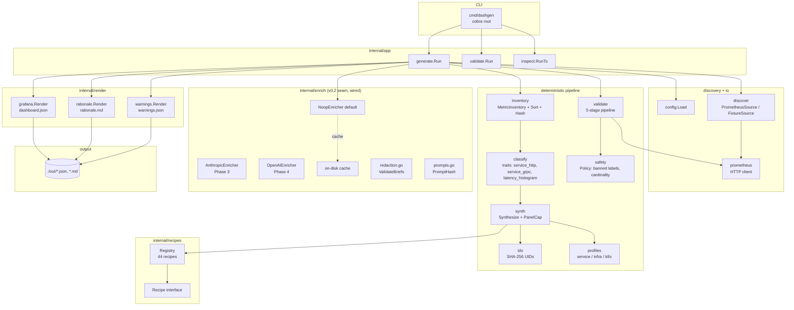
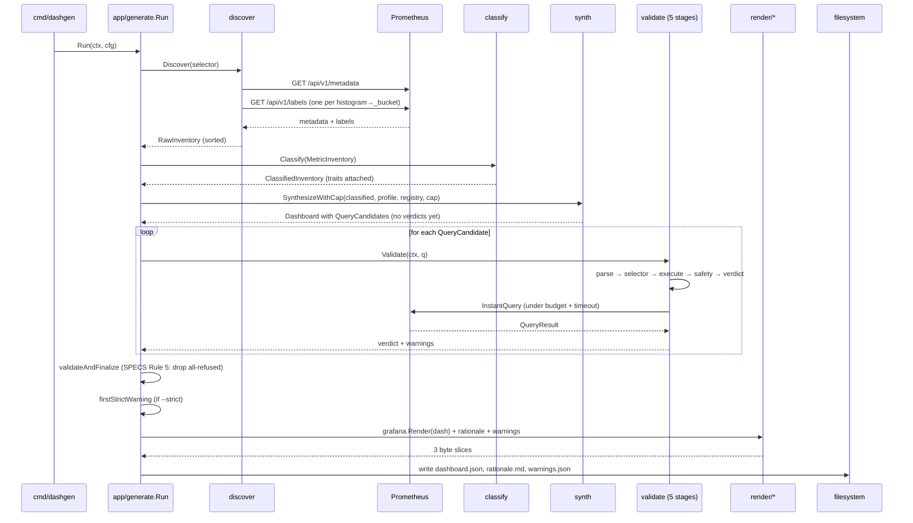

# Codebase Map

> Auto-generated by Cartographer. Last mapped: 2026-04-27.
>
> DashGen is a deterministic Prometheus → Grafana dashboard generator. The
> deterministic core is shipped (v0.1); v0.2 ships the full recipe catalog,
> Phase 6 offline tooling (`lint`, `coverage`, in-place regenerate), and
> two real AI-enrichment providers (Anthropic + OpenAI) that never touch
> PromQL. This map captures the runtime pipeline, the recipe catalog, the
> test fixture system, and the contract docs.

## System Overview



## Directory Structure

```
dashgen/
├── cmd/dashgen/              # cobra CLI: generate, validate, inspect
├── internal/
│   ├── app/                  # command orchestration (wires core into end-to-end flows)
│   │   ├── generate/         # `dashgen generate` pipeline + 3-file output
│   │   ├── validate/         # `dashgen validate <expr>...` thin wrapper
│   │   └── inspect/          # `dashgen inspect` diagnostic report
│   ├── config/               # RunConfig + YAML merge
│   ├── prometheus/           # HTTP client for /api/v1/*
│   ├── discover/             # metadata + label discovery (live + fixture)
│   ├── inventory/            # canonical MetricInventory + Sort + hash
│   ├── classify/             # deterministic trait classifier (3 traits)
│   ├── profiles/             # profile enum + section order + panel cap
│   ├── recipes/              # 44 recipe files + interface + helpers + registry
│   ├── synth/                # recipe-driven panel synthesis
│   ├── ids/                  # SHA-256 stable UID generator
│   ├── safety/               # denylist + cardinality policy
│   ├── validate/             # 5-stage query validation pipeline
│   ├── render/               # 3 output renderers (grafana / rationale / warnings)
│   └── enrich/               # v0.2 AI seam (Enricher iface + NoopEnricher + disk cache)
├── testdata/
│   ├── fixtures/             # 6 fixture sets (3 basic + 3 realistic)
│   └── goldens/              # matching goldens per fixture
├── scripts/                  # demo + capture helpers (not in Makefile)
├── .github/workflows/ci.yml  # CI: build + vet + fmt-check + race test + golangci-lint
├── docs/                     # this map
├── *.md                      # strategic docs (see §Docs Map below)
├── go.mod                    # module dashgen (Go 1.25), cobra + yaml.v3 + prometheus parser
├── Makefile                  # build / test / vet / fmt / check
└── .golangci.yml
```

## Package Guide

### Runtime pipeline (read in flow order)

| Package | Purpose | Key exports | Depends on |
|---------|---------|-------------|------------|
| `cmd/dashgen` | Cobra CLI entry; flag parsing; mutual-exclusion enforcement | `main`, three `*Cmd` functions | config, app |
| `internal/config` | `RunConfig` + `FileConfig` YAML merge with flag overrides | `RunConfig`, `Load`, `Defaults` | yaml.v3 |
| `internal/prometheus` | HTTP client for Prometheus `/api/v1/*` endpoints | `Client` iface, `HTTPClient`, `MetricMetadata`, `QueryResult` | net/http |
| `internal/discover` | Metadata + label discovery (live + fixture); normalizes into `RawInventory` | `Source` iface, `PrometheusSource`, `FixtureSource`, `RawInventory`, `Selector` | prometheus |
| `internal/inventory` | Canonical `MetricInventory` with sorted metric names + labels; hash-stable | `MetricInventory`, `MetricDescriptor`, `MetricType`, `InventoryHash` | sort, sha256 |
| `internal/classify` | Deterministic trait classifier; attaches `service_http`, `service_grpc`, `latency_histogram` by labels + name patterns + LOW-weight help-text hints (regex-gated, label-suppressed) | `Classify`, `ClassifiedInventory`, `Trait` constants | inventory, regexp |
| `internal/profiles` | Profile enum (`service`/`infra`/`k8s`) + section order + `PanelCap` | `Profile`, `Sections`, `PanelCap`, `IsKnown` | (none) |
| `internal/recipes` | 44 recipes + `Recipe` interface + helpers + 3 registries | `Recipe`, `Registry`, `NewServiceRegistry`, `NewInfraRegistry`, `NewK8sRegistry`, `safeGroupLabels`, `legendFor`, `DefaultRateWindow` | classify, inventory, ir, profiles |
| `internal/synth` | Recipe-driven panel synthesis; applies panel cap by `(Confidence desc, UID asc)` | `Synthesize`, `SynthesizeWithCap`, `snapshotOf` | classify, ids, inventory, ir, profiles, recipes |
| `internal/ids` | Stable SHA-256[:16] UIDs for dashboard + panel | `DashboardUID`, `PanelUID` | sha256 |
| `internal/safety` | Banned-label denylist + cardinality threshold + `le`-exemption | `Policy`, `NewPolicy`, `EvaluateGrouping`, `CardinalityRisk`, `BannedLabels` | ir, strings, sort |
| `internal/validate` | 5-stage query pipeline with budget + timeout | `Pipeline`, `New`, `Validate`, `Options`, `ValidationResult`, `Stage`, reason constants | ir, prometheus, safety, promql parser |
| `internal/render/grafana` | Grafana schema v39 JSON renderer | `Render` | ir |
| `internal/render/rationale` | Human-readable rationale Markdown | `Render` | ir |
| `internal/render/warnings` | Machine-readable warnings.json (sorted, deduplicated) | `Render` | ir |
| `internal/enrich` | **v0.2 seam, wired into `generate.Run` (commit `fa2f8f9`).** `Enricher` iface + `NoopEnricher` (default) + disk cache + provider registry (`factory.go`, the single extension point — adding a provider is one new file plus a `Register` call). **Phase 3 (anthropic) + Phase 4 (openai) shipped as real implementations**, both via `ANTHROPIC_API_KEY`/`OPENAI_API_KEY`, both cache-integrated. `ollama` remains an `ErrNotImplementedYet` placeholder so the v0.3 local-provider boundary stays shaped. Three sibling modules harden the seam: `redaction.go` (`ValidateBriefs` rejects any `MetricBrief.Labels` entry containing `=` so label *values* can never leak into outbound payloads); `prompts.go` (six canonical templates + `PromptHash()` SHA-256[:16] as a cache-invalidation hook); `payload_logger.go` (`PayloadLogger` callback + `PayloadLoggerSetter` iface — hosted providers emit a bounded redacted preview after `ValidateBriefs` passes, only when the hidden `--log-enrichment-payloads` debug flag is set). | `Enricher`, `NoopEnricher`, `Spec`, `Description`, `New`, `Register`, `Providers`, `Constructor`, `ErrUnknownProvider`, `ErrNotImplementedYet`, `ErrAnthropicNoAPIKey`, `ErrOpenAINoAPIKey`, `Cache`, `NewCache`, `CacheKey`, `Entry`, `MetricBrief` (label-names only), `ValidateBriefs`, `PromptHash`, `PayloadLogger`, `PayloadLoggerSetter`, classify/title/rationale request+response shapes (`ClassifyInput/Output`, `TitleInput/Output`, `RationaleInput/Output`, `TraitHint`, `PanelTitleProposal`, `PanelRationaleProposal`) | context, encoding/json, sort, net/http, crypto/sha256 |
| `internal/lint` | **v0.2 Phase 6 Step 3.0.** `Check` interface + 7 seed checks (banned-label, empty-panel, duplicate-panel, without-grouping, missing-rationale-row, rate-on-gauge, suspicious-units). Registry pattern mirrors `internal/enrich/factory.go` — adding a check is one new file plus one `Register` call. Output sorted by `(Code, PanelID, Message)` for byte-identical re-runs. | `Check`, `Issue`, `Severity`, `Input`, `Panel`, `Target`, `Register`, `RunAll`, `HasRefusal`, `CheckList` | sort, strings, fmt |
| `internal/coverage` | **v0.2 Phase 6 Step 3.1.** Pure-deterministic coverage report: given an inventory + dashboard refs, partitions into covered / uncovered / unknown-family clusters (string-prefix grouping; AI version is Phase 5 opt-in). | `Report`, `Summary`, `Family`, `Compute`, `FamilyOf`, `ExtractReferencedMetrics` | sort, strings |
| `internal/regenerate` | **v0.2 Phase 6 Step 3.2.** `WriteIfChanged(path, data)` — write only when bytes differ from on-disk content. Used by `generate --in-place` for idempotent re-runs (mtime preserved when output is unchanged). | `WriteIfChanged` | bytes, errors, os, path/filepath |

### Application layer

| Package | Purpose | Consumes |
|---------|---------|----------|
| `internal/app/generate` | End-to-end `generate` pipeline; `validateAndFinalize` applies SPECS Rule 5 (drop all-refused panels + empty sections); strict-mode enforcement after synthesis | discover, classify, synth, validate, render/{grafana,rationale,warnings}, safety |
| `internal/app/validate` | `validate` CLI: parse `--expr`/`--from`, run each through validate pipeline, emit JSON verdicts | discover, validate, prometheus |
| `internal/app/inspect` | `inspect` CLI: run pipeline up through synth + validate, emit human-readable tabwriter report (Inventory / Classification / Recipes / Candidates / Summary) | discover, classify, synth, validate, safety |
| `internal/app/lint` | `lint` CLI: read existing dashboard.json + (optional) rationale.md, run every registered check, emit deterministic JSON report. ErrInput / ErrRender / ErrLintFailure error categories | lint |
| `internal/app/coverage` | `coverage` CLI: read fixture metadata.json + (optional) dashboard.json, run coverage.Compute, emit deterministic JSON report. ErrInput / ErrRender error categories | coverage |

## Key Types

- **`inventory.MetricInventory`** — sorted-by-name view of Prometheus metrics; deterministic input to classification.
- **`inventory.MetricDescriptor`** — one metric family: name, type, help, labels, inferred unit/family.
- **`classify.Trait`** — enum: `TraitServiceHTTP`, `TraitServiceGRPC`, `TraitLatencyHistogram`. Set by labels (`{method,status_code,route,path,handler,code}` for HTTP; `grpc_*` for gRPC; `_bucket+le` + latency-shaped name for histograms) **and** narrow help-text regex hints (V0.2-PLAN Phase 1 item 3) gated so they only ADD a trait when no contradicting label or trait exists.
- **`classify.ClassifiedMetric`** — descriptor + inferred type, family, unit, traits.
- **`ir.Dashboard`** — finalized IR: UID, title, profile, variables, rows, dashboard-level warnings.
- **`ir.Row`** — section name + panels.
- **`ir.Panel`** — UID, title, kind, queries, unit, confidence, warnings, verdict, rationale.
- **`ir.QueryCandidate`** — PromQL expression, legend format, unit, verdict, warning codes, refusal reason.
- **`ir.Verdict`** — `VerdictAccept` | `VerdictAcceptWithWarning` | `VerdictRefuse`.
- **`validate.Options`** — `PerQueryTimeout`, `TotalBudget` (200 default), `Strict`.
- **`validate.Pipeline`** — stateless 5-stage validator with atomic budget counter.
- **`validate.ValidationResult`** — verdict, warning codes, refusal reason, failed stage.
- **`safety.Policy`** — denylist + cardinality + `le`-exemption.
- **`enrich.Enricher`** — AI seam interface (`Describe`, `ClassifyUnknown`, `EnrichTitles`, `EnrichRationale`).

## Data Flow

### `dashgen generate` happy path



### Validate pipeline (5 stages per query)

| # | Stage | Logic | Can return |
|---|-------|-------|------------|
| 1 | **parse** | Official PromQL parser validates syntax | `VerdictRefuse` + `ReasonParseError` |
| 2 | **selector** | Every vector selector has metric name or non-empty matcher; banned labels in matchers rejected | `VerdictRefuse` + `ReasonBannedLabelMatcher` / `ReasonSelectorError` |
| 3 | **execute** | Bounded `InstantQuery` (budget check first; per-query timeout). Empty result → warning, not refusal | `VerdictRefuse` + `ReasonBudgetExhausted` / `ReasonExecutionTimeout` / `ReasonExecutionError`; or `WarningEmptyResult` / `WarningBackendWarning` |
| 4 | **safety** | AST walk; banned-label-in-grouping → refuse. Cardinality > 4 scope-excluded dimensions → `WarningHighCardinalityGrouping`. Missing scope anchor → `WarningUnscopedAggregation` | `VerdictRefuse` + `ReasonBannedLabelGrouping`; or cardinality warnings |
| 5 | **verdict** | Compose: warnings present → `VerdictAcceptWithWarning`; strict + warnings → promote to `VerdictRefuse` + `ReasonStrictWarningUpgrade` | terminal verdict |

Defaults: `TotalBudget: 200` calls per run, `PerQueryTimeout: 5s` (app layer; validate package default is 3s).

## Recipe catalog (44 total)

### Recipe authoring

Every recipe implements the `Recipe` interface: `Name()`, `Section()`, `Match(ClassifiedMetricView) bool`, `BuildPanels(ClassifiedInventorySnapshot, Profile) []ir.Panel`. Recipes are registered in one of three profile registries and sorted by name for deterministic tie-breaking.

Shared helpers in `internal/recipes/helpers.go`:

- `safeGroupLabels(m, preferred...)` — always includes `job`+`instance` if present, adds preferred labels that exist on the descriptor, filters banned labels, sorts for determinism. Fallback: `["job"]`.
- `legendFor(labels)` — Grafana legend template `"{{job}} {{instance}}"`.
- `ensureLabel(labels, want)` — forces a label into the grouping (used for `le` on histogram_quantile).
- `without(labels, drop)` — strips a label from the legend (used to hide `le` from display).
- `statusLabelOf(m)` — first HTTP-status label (`status_code` or `code`) present on the descriptor.
- `DefaultRateWindow()` / `defaultRateWindow = "5m"`.

### Service profile (17 recipes)

| Name | Section | Confidence | Primary signal | Tier |
|------|---------|-----------|----------------|------|
| service_http_rate | traffic | 0.85 | counter + `service_http` trait | v0.1 |
| service_http_errors | errors | 0.85 | counter + status label + HTTP trait | v0.1 |
| service_http_latency | latency | 0.85 | histogram + `service_http` + `latency_histogram` | v0.1 |
| service_cpu | cpu | 0.85 | `process_cpu_seconds_total` or `container_cpu_usage_seconds_total` | v0.1 |
| service_memory | memory | 0.85 | `process_resident_memory_bytes` or `container_memory_working_set_bytes` | v0.1 |
| service_grpc_rate | traffic | 0.85 | counter + `service_grpc` trait | v0.2 T1 |
| service_grpc_errors | errors | 0.85 | `grpc_code != "OK"` filter | v0.2 T1 |
| service_grpc_latency | latency | 0.85 | histogram + `service_grpc` + `latency_histogram`; appends `_bucket` on bare metadata names | v0.2 T1 |
| service_goroutines | saturation | 0.90 | exact `go_goroutines` gauge, `max by (instance)` | v0.2 T1 |
| service_gc_pause | latency | 0.85 | `go_gc_duration_seconds` summary-or-histogram | v0.2 T1 |
| service_db_query_latency | latency | 0.80 | histogram with `latency_histogram` + name contains query/db/sql + NOT HTTP + NOT gRPC | v0.2 T2 |
| service_tls_expiry | saturation | 0.80 | gauge ending `_tls_not_after_timestamp` / `_cert_expiry_timestamp_seconds` / `_ssl_cert_not_after`; `(m - time()) / 86400` | v0.2 T2 |
| service_cache_hits | traffic | 0.80 | `*_cache_hits_total` + `*_cache_misses_total` pair | v0.2 T2 |
| service_client_http | traffic | 0.75 | counter + name contains "client" + has status label | v0.2 T2 |
| service_db_pool | saturation | 0.80 | `go_sql_stats_connections_in_use` + max; or `pgxpool_acquired_connections` + max | v0.2 T2 |
| service_job_success | errors | 0.80 | `*_jobs_succeeded_total` + `*_jobs_failed_total` (or success/failure variant) | v0.2 T2 |
| service_kafka_consumer_lag | errors | 0.85 | `kafka_consumergroup_lag` / `kafka_consumergroup_lag_sum` gauge (Tier-3 promoted) | v0.2 T2 |
| service_request_size | saturation | 0.75 | histogram with name ending `_request_size_bytes` + HTTP-shape guard (`method` or `handler`); accepts `_bucket` form via TrimSuffix | v0.2 T2 |
| service_response_size | saturation | 0.75 | histogram with name ending `_response_size_bytes` + HTTP-shape guard; same `_bucket` handling | v0.2 T2 |

### Infra profile (12 recipes)

| Name | Section | Confidence | Primary signal | Tier |
|------|---------|-----------|----------------|------|
| infra_cpu | cpu | 0.85 | `node_cpu_seconds_total` mode breakdown | v0.1 |
| infra_memory | memory | 0.85 | `node_memory_Mem{Available,Total}_bytes` pair | v0.1 |
| infra_disk | disk | 0.85 | `node_filesystem_{avail,size}_bytes` pair | v0.1 |
| infra_network | network | 0.85 | `node_network_{receive,transmit}_bytes_total` | v0.1 |
| infra_load | cpu | 0.90 | `node_load{1,5,15}` gauges | v0.2 T1 |
| infra_filesystem_usage | disk | 0.85 | used-ratio per `{instance, mountpoint, fstype}` | v0.2 T1 |
| infra_file_descriptors | overview | 0.90 | `process_{open,max}_fds` ratio | v0.2 T1 |
| infra_nic_errors | network | 0.85 | `node_network_*_{errs,drop}_total` counters | v0.2 T1 |
| infra_conntrack | saturation | 0.90 | `node_nf_conntrack_entries{,_limit}` ratio | v0.2 T2 |
| infra_disk_iops | disk | 0.85 | `node_disk_{reads,writes}_completed_total` | v0.2 T2 |
| infra_disk_io_latency | disk | 0.85 | `node_disk_io_time_seconds_total` / weighted variant | v0.2 T2 |
| infra_ntp_offset | overview | 0.90 | `node_timex_offset_seconds` | v0.2 T2 |
| infra_interrupts | saturation | 0.80 | exact `node_interrupts_total` counter | v0.2 T2 |

### Kubernetes profile (10 recipes)

| Name | Section | Confidence | Primary signal | Tier |
|------|---------|-----------|----------------|------|
| k8s_pod_health | pods | 0.90 | `kube_pod_status_phase` gauge | v0.1 |
| k8s_container_resources | resources | 0.85 | cAdvisor `container_cpu_*` / `container_memory_*` with namespace/pod filter | v0.1 |
| k8s_restarts | workloads | 0.75 | `kube_pod_container_status_restarts_total` | v0.1 |
| k8s_deployment_availability | workloads | 0.90 | `kube_deployment_{spec,status_replicas_available}_replicas` pair | v0.2 T1 |
| k8s_node_conditions | resources | 0.90 | 4-query fixed set over `kube_node_status_condition{condition=...}` | v0.2 T1 |
| k8s_pvc_usage | resources | 0.85 | `kubelet_volume_stats_{available,capacity}_bytes` | v0.2 T1 |
| k8s_oom_kills | pods | 0.90 | `kube_pod_container_status_terminated_reason{reason="OOMKilled"}` | v0.2 T1 |
| k8s_apiserver_latency | resources | 0.90 | `apiserver_request_duration_seconds` histogram, grouped by `{verb, resource, le}` | v0.2 T2 |
| k8s_etcd_commit | resources | 0.90 | `etcd_disk_backend_commit_duration_seconds` histogram | v0.2 T2 |
| k8s_hpa_scaling | workloads | 0.90 | `kube_horizontalpodautoscaler_status_{current,desired}_replicas` pair | v0.2 T2 |
| k8s_coredns | latency | 0.85 | paired `coredns_dns_request_duration_seconds` histogram + `coredns_dns_requests_total` counter | v0.2 T2 |
| k8s_scheduler_latency | latency | 0.85 | exact `scheduler_scheduling_attempt_duration_seconds` histogram + `result` label; accepts `_bucket` form | v0.2 T2 |

Every recipe ships with a `<name>_test.go` file: table-driven `Match` test covering the named look-alike negatives from `RECIPES.md`, plus a `BuildPanels` test verifying query shape, grouping, and (for pair-metric recipes) graceful omission when the pair is incomplete.

## Fixtures and tests

### Fixture shape

Each fixture under `testdata/fixtures/<name>/`:

- **`metadata.json`** — `map[metric_name] → [MetricMetadata{type,help,unit}]`; drives discovery.
- **`series.json`** — array of label sets (each includes `__name__`); drives label discovery and classification.
- **`labelnames/<metric>.json`** *(optional)* — per-metric label sets (mostly unused in current fixtures).
- **`instant/<sha256[:16]>.json`** — pre-recorded `QueryResult` responses, keyed by the SHA-256[:16] of the PromQL expression. Missing file ⇒ empty vector ⇒ `empty_result` warning.

### Fixture inventory

| Fixture | Purpose | Instant count | Typical metric shape |
|---------|---------|---------------|----------------------|
| `service-basic` | v0.1 foundational golden | ~10 | Go promhttp (`http_requests_total`, `http_request_duration_seconds`) + process runtime |
| `service-realistic` | Regression anchor for live-shape false positives | 14 | promhttp-style + queue counter with ambiguous `status` label + non-HTTP duration histogram |
| `infra-basic` | v0.1 foundational golden | ~5 | node_exporter essentials |
| `infra-realistic` | Cross-profile bleed guard + Tier-1 positives | 14 | node_* full set + cAdvisor metrics as negative guards |
| `k8s-basic` | v0.1 foundational golden | ~4 | kube-state-metrics + cAdvisor essentials |
| `k8s-realistic` | Tier-1 positives + node_exporter bleed guard | 13 | Full k8s Tier-1 inventory + `node_cpu_seconds_total` as negative |

### Test pattern

Per-profile fixture generates three end-to-end tests:

| Test | Asserts |
|------|---------|
| `TestGolden_<Profile><Class>` | Byte-identical `dashboard.json` + `rationale.md` + `warnings.json` match `testdata/goldens/<fixture>/`. `UPDATE_GOLDENS=1` rewrites. |
| `TestDeterminism_<Profile><Class>` | Two runs into separate tempdirs produce byte-identical output (catches map iteration / time leaks). |
| `TestDiscrimination_<Profile><Class>Realistic` | Explicit `shouldAppear` / `mustNotAppear` string assertions on `dashboard.json` — fails loudly with named offender if a recipe regresses into a look-alike. |

Plus per-recipe unit tests (`Test<Recipe>_Match` + `Test<Recipe>_BuildPanels`), `TestFirstStrictWarning` in `app/generate`, and the validate-subcommand coverage in `app/validate/validate_test.go`.

## Determinism guarantees

1. **Metric + label ordering** — `inventory.Sort()` lexical; `discover.{Prometheus,Fixture}Source` pre-sort labels per metric.
2. **Section ordering** — `profiles.Sections(profile)` returns a fixed slice; synth and render preserve.
3. **Stable UIDs** — `ids.DashboardUID` hashes `(profile, inventoryHash)`; `ids.PanelUID` hashes `(dashboardUID, section, metricName, kind)`. SHA-256[:16]. Numeric panel IDs (`grafana.Render`) fold the UID via FNV-1a modulo `panelIDSpace = 9007199254740881` (largest prime < 2^53) — wide enough to avoid the cross-collisions a prior `int32` modulus produced (commit `6d3c8e0`), narrow enough that Grafana's JS frontend can round-trip the value through `Number` without precision loss.
4. **Inventory hash** — `inventory.InventoryHash` sorts metrics + labels, joins with delimiters, hashes. Same inventory ⇒ same dashboard UID.
5. **Panel-cap tiebreak** — `(Confidence desc, UID asc)` via `sort.SliceStable`.
6. **Warning order** — every warning slice sorted; `warnings.Render` sorts entries by `(section, panel_uid, code)`.
7. **No map iteration leaks** — JSON tags enforce field order; panel layout computed deterministically.

## Safety policy

- **Banned labels** (never matcher'd or grouped by default): `request_id`, `session_id`, `trace_id`, `user_id`. Users extend via `config.LabelDenyList`.
- **Scope labels** (grouping is "scoped" if at least one appears in either selector or grouping): `instance`, `job`, `namespace`, `pod`, `service`, `node`.
- **Cardinality threshold**: 4 distinct grouping dimensions. `le` is **excluded** from the count (structural histogram bucket boundary).
- **Strict mode**: enforced at the app layer AFTER synth but BEFORE rendering, so one query warning doesn't cascade into a dashboard-wide refusal.

## CLI commands

| Command | Pipeline | Output |
|---------|----------|--------|
| `dashgen generate --prom-url <url> --profile {service,infra,k8s} [--out ./out] [--strict] [--in-place] [--dry-run] [--max-panels N] [--job X] [--namespace Y] [--metric-match Z] [--provider <name>] [--provider-model <id>] [--enrich titles,rationale,classify,all,none] [--cache-dir <path>] [--no-enrich-cache]` (plus hidden `--log-enrichment-payloads` when `DASHGEN_DEBUG=1`) | discover → classify → synth → validate × budget → finalize → render → applyEnrichment | 3 files (or stdout with --dry-run); `--in-place` skips rewrites when bytes are unchanged |
| `dashgen validate --prom-url <url> [--expr <e>]... [--from <file>] [--strict]` | parse → 5-stage validate | JSON array of verdicts |
| `dashgen inspect --prom-url <url> --profile X [--max-panels N]` | same as generate up to validate | tabwriter report: Inventory / Classification / Recipes / Candidates / Summary |
| `dashgen lint --in <bundle-dir> [--out <file>]` | parse dashboard.json + rationale.md → run all registered checks → sort issues | deterministic JSON report; exit 7 on any refusal |
| `dashgen coverage --fixture-dir <dir> [--in <bundle-dir>] [--out <file>]` | parse metadata.json + (optional) dashboard.json → coverage.Compute | deterministic JSON report (covered, uncovered, unknown_families) |

## v0.2 enrichment seam

`internal/enrich` is **wired into `generate.Run`** (commit `fa2f8f9`, "v0.2 step 0.5"). The seam is non-bypassable and determinism-preserving in the default (Noop) configuration. Phase 3 + Phase 4 ship two real hosted providers (Anthropic, OpenAI) end-to-end.

**Wiring point:** `internal/app/generate/generate.go:applyEnrichment` runs after `validateAndFinalize`. Constructs the enricher via `enrich.New(Spec{Provider, Model, CacheDir, NoCache})`, returns immediately if provider resolves to noop, and otherwise (a) type-asserts the enricher onto `enrich.PayloadLoggerSetter` and installs a stderr debug logger when `cfg.LogEnrichmentPayloads` is set, then (b) dispatches per `cfg.EnrichModes` via `containsMode(modes, "titles")` / `containsMode(modes, "rationale")` (the `"all"` mode subsumes both; `"none"` short-circuits). `applyTitleEnrichment` builds `[]enrich.PanelTitleRequest` from non-refused panels (PanelUID + mechanical title + section + rationale) and on success populates `Panel.MechanicalTitle`; `applyRationaleEnrichment` does the same for `Panel.RationaleExtra` (PromQL exprs included in the request). Soft-fail policy: per-mode error logs `enrich titles: <err>` / `enrich rationale: <err>` to stderr and skips that single mutation while letting the other mode continue — mechanical output stays intact, AI failures never crash a run. `classify` mode is `// TODO(phase-5)`. Dispatch landed in commit `1c2f298`; on-path determinism + degradation tests in `applyenrich_onpath_test.go` (commit `dc530d9`); canary smoke scripts (`scripts/smoke-anthropic.sh`, `scripts/smoke-openai.sh`) confirm byte-identical output across repeated live runs.

**Extension contract:** `internal/enrich/factory.go` is the single extension point. Adding a provider requires one new file in `internal/enrich/` (e.g. `ollama.go`) containing a `Constructor` of type `func(Spec) (Enricher, error)` plus a one-line `enrich.Register("name", ctor)` in its `init()`. Nothing else changes — `applyEnrichment` already calls `enrich.New(Spec{Provider: cfg.Provider, ...})` and dispatches by `Describe()`. CLI surface accepts any name registered. See V0.2-PLAN §2.7.

**Hosted providers shipped:**

| Provider | Endpoint | Default model | API-key env | Methods implemented | Phase |
|----------|----------|---------------|-------------|---------------------|-------|
| `anthropic` | `https://api.anthropic.com/v1/messages` (Messages API, `anthropic-version: 2023-06-01`) | `claude-opus-4-7` | `ANTHROPIC_API_KEY` | `Describe`, `ClassifyUnknown`, `EnrichTitles`, `EnrichRationale` | 3 |
| `openai` | `https://api.openai.com/v1/chat/completions` (Chat Completions, `Bearer` auth) | `gpt-5` | `OPENAI_API_KEY` | `Describe`, `ClassifyUnknown`, `EnrichTitles`, `EnrichRationale` | 4 |

Both providers share defaults: 1024 max tokens, 30s HTTP timeout, 1 retry (10ms backoff) on 429/5xx. Missing API key returns `ErrAnthropicNoAPIKey` / `ErrOpenAINoAPIKey` at construction (NOT `ErrNotImplementedYet`); both are wrapped as `ErrBackend` by `Run`. `ollama` remains an `ErrNotImplementedYet` placeholder for v0.3.

**Config knobs (`internal/config/config.go`):**

- `Provider string` — zero-value `""`, `"off"`, or `"noop"` selects `NoopEnricher`. Resolved via `enrich.New(Spec{Provider:...})` in `applyEnrichment`. `"anthropic"`, `"openai"` are real impls (Phase 3+4); `"ollama"` is a registered placeholder returning `ErrNotImplementedYet`; any other name returns `ErrUnknownProvider`. Both error sentinels are wrapped as `ErrBackend` by `Run`.
- `Model string` — overrides the provider's default model id (e.g. pin `claude-sonnet-4-6`, `gpt-5-mini`); ignored when Provider is `""`/`"off"`/`"noop"`.
- `EnrichModes []string` — subset of `{titles, rationale, classify, unknown-grouping, all, none}`. Empty/nil ⇒ no enrichment even if a provider is configured.
- `CacheDir string` — overrides default `~/.cache/dashgen/enrich`; empty ⇒ default.
- `NoEnrichCache bool` — forces re-fetch (defaults false).
- `LogEnrichmentPayloads bool` — runtime knob for the hidden `--log-enrichment-payloads` debug flag; never part of the YAML `FileConfig` schema. When true, hosted providers receive a `PayloadLogger` that prints `(fnName, byteCount, redacted-preview)` to stderr per outbound HTTP call, AFTER `ValidateBriefs` succeeds.

**IR additions (`internal/ir/types.go`):**

- `Panel.MechanicalTitle string` — populated by enricher; empty in noop path; renderers MUST NOT branch on presence.
- `Panel.RationaleExtra string` — supplementary AI prose appended to mechanical rationale; empty in noop path.

**Test contract (`internal/app/generate/applyenrich_test.go`):**

| Test | Asserts |
|------|---------|
| `TestApplyEnrichment_NoopPassthrough_Smoke` | Same dashboard pointer returned, zero mutations, `MechanicalTitle`/`RationaleExtra` stay empty (proves seam is non-bypassable). |
| `TestApplyEnrichment_UnknownProviderRejected` | Unknown provider strings fail fast (wrappable as `ErrBackend`). |
| `TestApplyEnrichment_NoopDefault_ByteIdenticalOutput` | Full pipeline output is byte-equal to v0.1 service-basic golden — the "AI-off parity" acceptance criterion (V0.2-PLAN §6). |

**Cache** — on-disk; key = `(InventoryHash, Function, ProviderID, PromptHash, DashgenVersion)` where `ProviderID = "<provider>:<model>"` (e.g. `"anthropic:claude-opus-4-7"`) and `Function ∈ {classify_unknown, enrich_titles, enrich_rationale}`. Atomic `Put` via `CreateTemp` + `Rename`; corrupt entries self-heal on next write. Any byte change to canonical prompt templates flips `PromptHash()` and invalidates every entry.

**Redaction (`internal/enrich/redaction.go`):** `ValidateBriefs([]MetricBrief)` runs before every outbound HTTP call. Rejects any label entry containing `=` (covers both raw `pod=checkout` and quoted `pod="checkout"` forms) so label *values* can never leak. Failure returns a non-nil error naming metric + offending label; caller short-circuits. Per V0.2-PLAN §2.5 — input types carry only metric names + label *names*, never label values.

**Prompt templates (`internal/enrich/prompts.go`):** Six canonical templates (TitleSystem/User, RationaleSystem/User, ClassifySystem/User), all forbidding PromQL output explicitly and pinning strict response JSON shapes. `PromptHash()` returns SHA-256[:16] over `strings.Join(parts, "|")` of all six — single source of truth for the cache-invalidation hook (V0.2-PLAN §2.4).

**Payload logger (`internal/enrich/payload_logger.go`):** Debug-only stderr trace for outbound payloads. `PayloadLogger = func(fnName string, byteCount int, preview string)`; preview is bounded `payloadPreview(96 head + 96 tail)` over **wire bytes after marshal** (so the redaction guarantee carries through). `PayloadLoggerSetter` interface (`SetPayloadLogger(PayloadLogger)`) implemented by hosted providers only. Wired by cmd layer when the hidden `--log-enrichment-payloads` flag is set (visible only with `DASHGEN_DEBUG=1`).

## Docs map

| Doc | Authoritative for |
|-----|-------------------|
| `README.md` | User-facing quickstart; CLI flags |
| `docs/PRODUCT_DOC.md` | **Product scope + release gates** (owns what ships in each stage) |
| `docs/SPECS.md` | **v0.1 execution contract** (non-negotiables, validation pipeline, Rule 5) |
| `docs/ARCHITECTURE.md` | **System design + package responsibilities** |
| `docs/STRUCTURE.md` | **Repo layout + dependency direction** |
| `docs/ROADMAP.md` | Staged timeline + cross-stage rules |
| `docs/RECIPES.md` | **Recipe catalog + authoring contract + test matrix** |
| `docs/V0.2-PLAN.md` | **v0.2 enrichment contract + AI boundary + phased delivery** |
| `docs/RECIPES-DSL.md` | **v0.3 DRAFT.** YAML wire + CUE schema + text/template runtime; migration plan for all 44 → 47 recipes; supersedes the Go-recipe authoring contract once Phase 0 ships |
| `docs/RECIPES-DSL-ADVERSARY.md` | **v0.3 DRAFT.** DSL threat model: 20 threats, 15 invariants, adversary corpus, reviewer audit checklist |
| `docs/RECIPES-CLI.md` | **v0.3 DRAFT.** `dashgen recipe ...` 8-subcommand surface (init / scaffold / lint / list / show / test / explain / diff) + 10 CLI-surface threats |
| `docs/AI-PROVIDERS.md` | **Anthropic + OpenAI + ollama provider matrix:** setup, env vars, default models, redaction contract, cache behavior, failure modes |
| `docs/lint.md` | `dashgen lint` check catalog + JSON output schema (Phase 6) |
| `docs/coverage.md` | `dashgen coverage` report schema + family-grouping behavior (Phase 6) |
| `docs/BIG_ROCKS.md` | Strategic-revisit doc on recipe authoring & user extensibility (revisit when forcing functions in §9 fire); v0.3+ scaffolder + contrib path |
| `docs/ADVERSARY.md` | **Trust validation + code review checklist** |
| `docs/PRD.md` | Historical PRD; superseded by PRODUCT_DOC |
| `CLAUDE.md` | LLM coding guidelines |
| `CONTRIBUTING.md` | PR checklist + commit style |

> Long-form docs were moved from repo root into `docs/` in commit `107c07b`; only `README.md`, `CONTRIBUTING.md`, `CLAUDE.md`, and `LICENSE` remain in the root.

## Conventions

- **Package layout**: `cmd/` holds CLI entry; `internal/` holds everything else. One package per semantic concern.
- **Naming**: snake_case for recipe names (`service_http_rate`); PascalCase for exported types.
- **Trait naming**: `TraitService<Family>` (e.g., `TraitServiceHTTP`, `TraitServiceGRPC`) or shape-descriptive (`TraitLatencyHistogram`).
- **Confidence**: 0.90+ exact-name; 0.80–0.89 strong label+name; 0.70–0.79 shape-only. Lower values reserved for v0.2 AI-enriched unknowns.
- **Error categories**: `ErrBackend`, `ErrRender`, `ErrStrictViolation` in `app/generate`; enable mapping to CLI exit codes.

## Gotchas

- **Histogram bare-base `_bucket` append** — Prometheus metadata returns the base name (without `_bucket`), but the queryable series IS `_bucket`. Both `discover.PrometheusSource` / `FixtureSource` fall back to `<name>_bucket` for label discovery when `type == "histogram"` and name lacks partial suffix. Recipes append `_bucket` to the metric name when synthesizing queries for bare-base histograms (see `service_grpc_latency.go`).
- **`le` exemption from cardinality** — `le` is a structural bucket boundary, mandatory for `histogram_quantile`, always bounded. `safety.Policy.CardinalityRisk` explicitly skips it when counting grouping dimensions.
- **Trait vs name matching** — some recipes fire on traits (broad); others require exact metric names (narrow). This is intentional — recipes with look-alike risk on real backends use name equality or name-substring guards to tighten.
- **Help-text hint suppression** — `classify.applyHelpHint` only fires AFTER label/name signals and only when the metric's labels are entirely within the infrastructure-only allowlist `{instance, job, le}`. Any other label (e.g. `db_query`, `query_type`, `queue`) is treated as positive domain evidence and suppresses the hint. Mutual exclusivity is enforced: an HTTP hint never overrides an existing gRPC trait, and vice versa. `TraitLatencyHistogram` is intentionally never emitted from help text — it must be structural (`_bucket` + `le`).
- **Strict mode outside the pipeline** — `validate.Pipeline` runs with `Strict: false` inside synth+validate; strict enforcement happens at `app/generate` layer AFTER finalization, in `firstStrictWarning`. This lets one query warning NOT cascade into dashboard-wide refusal that can't be introspected.
- **`empty_result` is a warning, not an omission** — a query returning zero series still emits a panel with warning; the panel only DROPS if every candidate on it refuses (SPECS Rule 5).
- **Renderer separation** — grafana/rationale/warnings renderers read the same IR independently; rendering cannot change verdicts or emit new queries. Synthesis is recipe-driven; rendering is schema-shaped.
- **Registry sort order** — recipes are sorted by `Name()` in the registry so that tie-breaks during panel-cap enforcement are deterministic across runs.

## Navigation Guide

| To do… | Touch |
|--------|-------|
| **Add a new recipe** | Create `internal/recipes/<name>.go` + `<name>_test.go` following the authoring contract (§1 of `RECIPES.md`); register in `registry.go`; update `service_memory_test.go`'s registry-count list; extend the relevant `*-realistic` fixture with a positive case AND at least one look-alike; regenerate goldens with `UPDATE_GOLDENS=1`. |
| **Add a new classifier trait** | Edit `internal/classify/classify.go` (new `Trait` const + detection in `classifyOne`); if the trait should accept LOW-weight help-text hints, extend `helpHints` with a strict regex AND `applyHelpHint`'s switch (mind the infra-label suppression rule); add table cases in `classify_test.go` covering positive label evidence, help-only positive, and contradicting-label suppression; document the trait in `RECIPES.md §6`. |
| **Change a safety rule** | Edit `internal/safety/policy.go`; add test cases in `policy_test.go` covering both the positive and regression case; check `safety.CardinalityRisk` handling of `le`. |
| **Add a validate stage** | Edit `internal/validate/validate.go` (insert a new case in `Pipeline.Validate`'s stage switch) and one of the stage files (`execute.go` / `selector.go` / `safety_stage.go`); extend `ValidationResult` if new reasons apply; add `TestRun/<stage>_case` in `app/validate/validate_test.go`. |
| **Add a new output format** | Create `internal/render/<format>/render.go` implementing `Render(*ir.Dashboard) ([]byte, error)`; wire into `app/generate.Run`; do NOT branch inside existing renderers. |
| **Add a new profile** | Extend `profiles.Profile` + `profiles.Sections` + `profiles.PanelCap`; create `NewXxxRegistry()` in `internal/recipes/registry.go`; add `xxx-basic` + `xxx-realistic` fixtures + goldens; add `TestGolden_XxxBasic` + discrimination test. |
| **Support a new backend** | Add an implementation of `discover.Source` + `prometheus.Client` in a new subpackage; wire into `app/generate.buildBackend` behind a new CLI flag; update mutual-exclusion check. |
| **Wire in an AI provider** | Implement `enrich.Enricher` in `internal/enrich/<provider>.go` (hosted shipped in v0.2: `anthropic.go` Phase 3, `openai.go` Phase 4; local backlog for v0.3: ollama / llama.cpp / lm-studio); call `enrich.Register("<provider>", ctor)` in that file's `init()` — no edit to `applyEnrichment` is needed because the factory dispatches by registry. Read API keys from env (`ANTHROPIC_API_KEY` / `OPENAI_API_KEY`). Run inputs through `enrich.ValidateBriefs` before any HTTP call. If you want hidden debug visibility, expose `SetPayloadLogger` (`PayloadLoggerSetter` iface) on the concrete type. Cache through existing `enrich.Cache` with key composition `("<provider>:<model>", function, PromptHash())`; never generate PromQL or upgrade verdicts (V0.2-PLAN §2.2 + §2.7). |
| **Regenerate goldens after an intentional change** | `UPDATE_GOLDENS=1 go test ./internal/app/generate/...` |
| **Snapshot a live Prometheus into a fixture** | `scripts/capture-prometheus.sh <prom-url> <fixture-dir>` |

---

**Recipe count:** 44 recipes (12 v0.1 + 32 v0.2). **Tests:** 604 pass across 25 packages (with `-race`, including on-path enrichment dispatch determinism + degradation tests and the Phase 3 + Phase 4 hosted-provider proxy-capture canaries; live-API smoke tests gated on `ANTHROPIC_API_KEY` / `OPENAI_API_KEY`). **Total tracked source files:** 280 (~321k tokens). **CLI subcommands:** generate, validate, inspect, lint, coverage. **AI enrichment:** anthropic (Phase 3) + openai (Phase 4) wired end-to-end through `applyEnrichment` (commit `1c2f298`); ollama placeholder for v0.3. **Lint (toolchain):** golangci-lint v2.11.4 (config v2 schema; CI workflow uses `golangci-lint-action@v9`).
