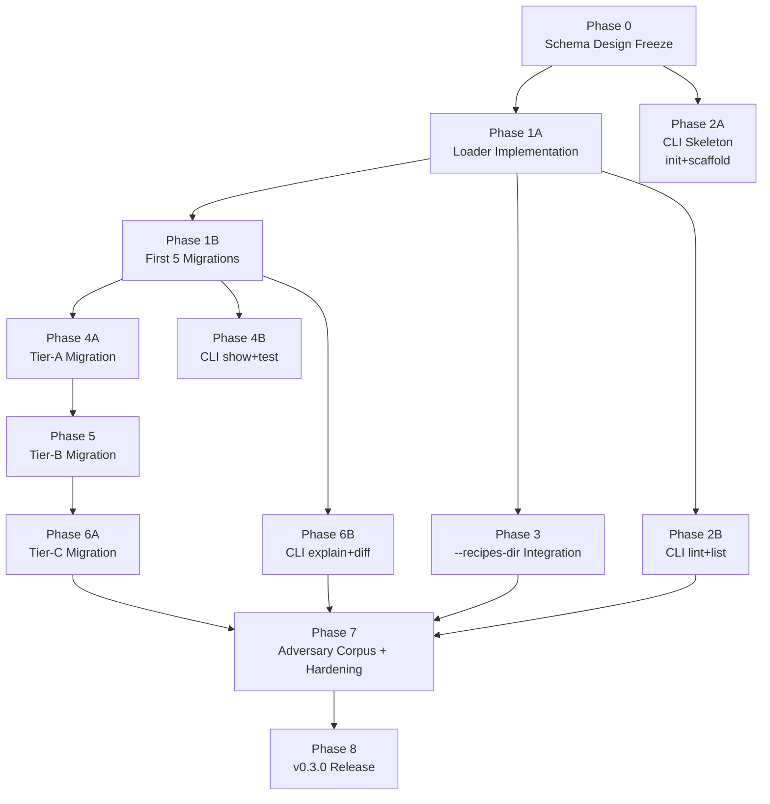

# v0.3 Recipe DSL — Implementation Plan

> Status: DRAFT (2026-04-27). Translates the three v0.3 design specs
> into an executable task plan with team assignments and DoD per task.
>
> Source specs (do not duplicate; reference):
> - [`RECIPES-DSL.md`](RECIPES-DSL.md) — DSL contract.
> - [`RECIPES-DSL-ADVERSARY.md`](RECIPES-DSL-ADVERSARY.md) — threat model.
> - [`RECIPES-CLI.md`](RECIPES-CLI.md) — `dashgen recipe ...` CLI surface.

---

## 0. Executive Summary

Eight execution phases, each suitable for one OMC team launch. Total scope: ~50 tasks. Critical path: Phase 0 → 1A → 1B → 4A → 5 → 6A → 7 → 8 (sequential migration). CLI work (Phases 2A, 2B, 4B, 6B) parallels the DSL track once the loader exists.

| Phase | Title | Critical-path? | OMC team size | Est. effort |
|---|---|---|---|---|
| 0 | Schema Design Freeze | yes | 3 (architect + critic + writer) | 1–2 days |
| 1A | Loader Implementation | yes | 3 (executor × 2 + test-engineer) | 2–3 days |
| 1B | First 5 Recipe Migrations | yes | 2 (executor + verifier) | 2 days |
| 2A | CLI Skeleton + init/scaffold | parallel | 1 (executor) | 1 day |
| 2B | CLI lint + list | parallel | 2 (executor + test-engineer) | 1–2 days |
| 3 | --recipes-dir + Generate Integration | parallel | 1 (executor) | 1 day |
| 4A | Tier-A Migration (10 recipes) | yes | 1 (executor) | 2 days |
| 4B | CLI show + test | parallel | 1 (executor opus) | 2 days |
| 5 | Tier-B Migration (12 recipes) | yes | 1 (executor) | 3 days |
| 6A | Tier-C Migration (22 recipes + 3 splits) | yes | 2 (executor opus + verifier) | 4–5 days |
| 6B | CLI explain + diff | parallel | 2 (executor opus + test-engineer) | 2–3 days |
| 7 | Adversary Corpus + Hardening | yes | 2 (executor opus + security-reviewer opus) | 3 days |
| 8 | v0.3.0 Release | yes | 2 (writer + verifier) | 1 day |

**Calendar critical path:** ~22 working days end-to-end if phases run sequentially. Parallelizing the CLI track (phases 2A/2B/4B/6B run alongside DSL track) collapses to ~16 working days.

**Decision gate after Phase 0:** if the schema doesn't unify all 47 example recipes cleanly, stop. Re-design before Phase 1A starts.

---

## 1. Phase Dependency Graph



The CLI track (P2A → P2B → P4B → P6B) can run in parallel with the migration track (P4A → P5 → P6A) once Phase 1B lands. The two tracks reconverge at Phase 7.

---

## 2. Team-Assignment Conventions

Every task is owned by exactly one **agent type** at a specific **model tier**. Phases that need cross-discipline review pair an executor with a critic / code-reviewer / verifier.

| Agent type | When to use | Default model |
|---|---|---|
| `architect` | Design decisions, system-shape choices | opus |
| `critic` | Adversarial review of designs / specs | opus |
| `executor` | Code implementation, file editing | sonnet (opus for complex multi-file work) |
| `test-engineer` | Test scaffolding, fixture extension, parameterized harnesses | sonnet |
| `code-reviewer` | Post-implementation review of diffs | opus |
| `security-reviewer` | Adversary corpus + threat verification | opus |
| `verifier` | Pre-release green-light checks (build, test, golden parity) | sonnet |
| `writer` | Doc updates, release notes, user-facing copy | sonnet |
| `planner` | Phase decomposition + task scoping | opus (rarely used inside this plan since the plan IS the decomposition) |

**Rule:** never have one agent both author AND review code in the same active context (per global CLAUDE.md `<execution_protocols>`). When an executor finishes a phase, a separate code-reviewer or verifier signs off.

---

## 3. Phase Specifications

Each phase below maps 1:1 to an OMC team launch. Format per task:

- **ID** — stable identifier (PhaseLetterTaskNumber, e.g. `T0.1`).
- **Subject** — imperative one-liner.
- **Owner** — agent type.
- **Model** — opus / sonnet.
- **Depends on** — list of task IDs (within or across phases).
- **Scope** — what's in / what's explicitly out.
- **DoD** — Definition of Done. Three components:
  1. **Functional** — what behavior must be verifiable.
  2. **Quality** — what's reviewed / linted / tested.
  3. **Integration** — what existing surface must remain green.

Phase-level DoD aggregates per-task DoDs plus phase-acceptance criteria.

---

### Phase 0 — Schema Design Freeze

**Goal:** Lock the CUE schema, helper namespace, error-mapping policy, and migration-tier mapping. Output is review-ready specs that can be implemented without further design decisions.

**Depends on:** none (starts now).

**OMC team:** `team v0-3-phase-0`, 3 workers.

#### Tasks

##### T0.1 — Author the canonical CUE schema (`schema.cue`)
- **Owner:** architect
- **Model:** opus
- **Depends on:** —
- **Scope:**
  - In: write the full `schema.cue` covering `#Recipe`, `#MatchPredicate`, `#PanelTemplate`, `#PairSpec`, `#Section`, `#Unit`, `#TraitName`, plus the four composition definitions in DSL §4.5.
  - In: pin the predicate node-count + depth caps in CUE (T7 mitigations).
  - In: enforce the mutex constraint on name predicates (DSL §4.2).
  - In: ASCII-only constraint on metric-name fields (T20 mitigation).
  - Out: the loader Go code (Phase 1A).
  - Out: any concrete recipe YAML (Phase 1B).
- **DoD:**
  - **Functional:** schema file lives at `internal/recipes/schema.cue`. `cue eval -c schema.cue` produces no errors.
  - **Quality:** every constraint in DSL §4 + every threat-mitigation in ADVERSARY §2 that maps to a CUE constraint is present and labelled with a `// ADVERSARY: T<n>` comment.
  - **Integration:** all 7 example recipes in DSL §5.2 unify cleanly with the schema (`cue eval -c schema.cue example.yaml` exits 0 for each). Pin the seven examples as `internal/recipes/testdata/valid/*.yaml` so the schema and examples co-evolve.

##### T0.2 — Lock the helper namespace + RenderContext shape
- **Owner:** architect
- **Model:** opus
- **Depends on:** T0.1 (the schema references the helper names)
- **Scope:**
  - In: write `internal/recipes/helpers_namespace.md` (or extend `RECIPES-DSL.md` §7.3) listing every helper, its Go signature, semantics, determinism guarantees, and which threat IDs (if any) gate its inclusion.
  - In: pin the `RenderContext` struct shape (DSL §7.2) and document why `Labels` carries names-only.
  - In: document the explicit "banned helpers" set (`now`, `env`, `exec`, `readFile`, `httpGet`, `time`).
  - Out: implementation of the helpers (Phase 1A T1A.4).
- **DoD:**
  - **Functional:** docs/note exists; every helper used in any of the 7 example recipes from §5.2 is documented; no helper used in examples is missing from the namespace.
  - **Quality:** the doc declares ownership policy for adding helpers (per DSL §16: docs PR + ≥2 user-recipe demand cases).
  - **Integration:** existing `internal/recipes/helpers.go` (used by Go recipes) is mapped 1:1 to the new namespace OR explicitly noted as deprecated for the YAML world.

##### T0.3 — Critic adversarial review of T0.1 + T0.2
- **Owner:** critic
- **Model:** opus
- **Depends on:** T0.1, T0.2
- **Scope:**
  - In: red-team the schema against the 20 threats in ADVERSARY §2. For each threat, confirm the schema (or downstream loader) actually mitigates it, OR file an issue.
  - In: stress-test the schema against the 22 Tier-C recipes in DSL §12.1: do all 22 unify? Spot-check at least 5.
  - In: walk the slippery-slope concern (BIG_ROCKS §4): does the schema accept exactly the patterns we want, and reject "general programmability" attempts?
  - In: produce a written review (≤200 lines) with PASS / WARN / FAIL findings.
  - Out: fixes for any FAIL findings (those become T0.5+ remediation tasks).
- **DoD:**
  - **Functional:** review document committed at `docs/V0.3-PHASE-0-REVIEW.md`.
  - **Quality:** every threat (T1–T20) is referenced; every Tier-C recipe spot-checked is named.
  - **Integration:** zero FAIL findings, OR each FAIL has a follow-up task filed before phase exit.

##### T0.4 — Pin the migration-tier table (`migration_tiers.yaml`)
- **Owner:** writer
- **Model:** sonnet
- **Depends on:** T0.1
- **Scope:**
  - In: produce a structured YAML file at `internal/recipes/testdata/migration_tiers.yaml` listing all 44 (→ 47) recipes with: name, tier (A/B/C), source `internal/recipes/<name>.go`, target YAML path, splits (if any), schema features used, expected golden delta.
  - This is the load-bearing reference for Phases 4A/5/6A. Without it, those phases drift.
  - Out: any Go code; out: any YAML migrations.
- **DoD:**
  - **Functional:** YAML file exists; passes `yamllint`. 47 entries.
  - **Quality:** every Tier-C recipe lists which schema feature(s) it uses (`pair_with`, `requires_metric_type`, `requires_pair`, etc.). Every split is documented with both target names.
  - **Integration:** loaded by a `TestMigrationTiers_Coverage` test in T1A — but the test itself is Phase 1A, not here. Here the file is the source of truth.

#### Phase 0 acceptance

- [ ] `internal/recipes/schema.cue` exists and unifies all 7 example recipes.
- [ ] Helper namespace doc exists, complete, signed off.
- [ ] Critic review delivered with zero open FAILs.
- [ ] Migration tier table covers 44 → 47 recipes with schema-feature mapping.
- [ ] Open questions in DSL §16 are EITHER resolved (decision recorded) OR explicitly carried forward into Phase 1A as task-level questions.
- [ ] One commit: `docs(v0.3): phase 0 schema design freeze`. No Go code in this commit.

---

### Phase 1A — Loader Implementation

**Goal:** Implement the YAML → CUE → Go-struct → Recipe-interface pipeline. No recipe migrations yet; just the machinery.

**Depends on:** Phase 0 complete.

**OMC team:** `team v0-3-phase-1a`, 3 workers.

#### Tasks

##### T1A.1 — Implement `internal/recipes/schema_embed.go` + `loader.go`
- **Owner:** executor
- **Model:** opus (multi-file complex)
- **Depends on:** Phase 0
- **Scope:**
  - In: `//go:embed schema.cue` shim. Loader package skeleton. `LoaderConfig` (caps, deadline, dirs).
  - In: discovery walk (`discover()` per DSL §9.1) with size + count caps + symlink-escape rejection (T11).
  - In: validation pipeline steps 1–6 from DSL §9.2 (yaml → JSON → CUE → unify → validate → decode).
  - In: error-mapping translation table from CUE diagnostics to user messages (DSL §9.3).
  - Out: the matcher, template engine, pair resolver (separate tasks T1A.2–T1A.4).
  - Out: any recipe migration (Phase 1B).
- **DoD:**
  - **Functional:** `go build ./internal/recipes/` clean. `loader.Load(ctx, configWithBuiltinFS)` returns the parsed YAMLRecipe slice for all 7 example recipes from DSL §5.2.
  - **Quality:** loader_test.go covers: happy path × 7 examples; each invalid YAML in `testdata/invalid/` produces the documented error message; resource caps trigger expected exit code.
  - **Integration:** `go vet ./...` clean. `go test -race -count=1 ./internal/recipes/...` passes (existing Go-recipe tests still green; new loader tests added).

##### T1A.2 — Implement `internal/recipes/matcher.go`
- **Owner:** executor
- **Model:** sonnet
- **Depends on:** T1A.1 (matcher consumes the decoded MatchPredicate struct)
- **Scope:**
  - In: pure-Go evaluator for the match predicate AST. Every primitive + combinator from DSL §6.3.
  - In: regex compilation cached on the predicate; pattern length cap (T4).
  - In: predicate node-count + depth check at decode time (T7).
  - Out: the registry; out: pair resolution.
- **DoD:**
  - **Functional:** `matcher.Eval(predicate, ClassifiedMetricView) bool` for every primitive type returns the correct boolean. Table-driven test covers all 14 primitive evaluations + 3 combinators.
  - **Quality:** ReDoS test asserts O(n) matching time on `(a+)+$` against a 10000-character input (RE2 invariant).
  - **Integration:** existing `internal/classify` types unchanged.

##### T1A.3 — Implement `internal/recipes/template.go`
- **Owner:** executor
- **Model:** sonnet
- **Depends on:** T0.2 (helper namespace locked)
- **Scope:**
  - In: `text/template.New()` setup with `Option("missingkey=error")`.
  - In: AST walk that rejects `define`/`template`/`block` directives at parse time (T5 mitigation).
  - In: AST node-count budget enforcement.
  - In: helper FuncMap binding for every helper in T0.2's namespace.
  - In: render-time output size cap (T6).
  - Out: actual recipe migrations.
- **DoD:**
  - **Functional:** `template.Render(query_template, ctx)` produces the expected PromQL string for each of the 7 example recipes (golden text comparison).
  - **Quality:** template_test.go covers: every helper at least once; every forbidden directive is rejected; output cap triggers refusal.
  - **Integration:** existing helper functions (`safeGroupLabels`, `legendFor`, etc.) bound into the new FuncMap; the same helpers continue to work for Go recipes during co-existence.

##### T1A.4 — Implement `internal/recipes/pair.go`
- **Owner:** executor
- **Model:** sonnet
- **Depends on:** T1A.1
- **Scope:**
  - In: `pair.Resolve(spec, snapshot, matchedMetric) (PairContext, error)` per DSL §8.1.
  - In: all three resolver modes (`suffix_swap`, `prefix_swap`, `explicit`).
  - In: `on_missing` semantics: `omit` / `warn` / `use_first_only`.
  - Out: anything beyond pair resolution.
- **DoD:**
  - **Functional:** for each Tier-C example in DSL §5.2 (`infra_filesystem_usage`), pair resolution succeeds against a fixture with both halves; fails with `ErrPairMissing` against a fixture without the pair half.
  - **Quality:** pair_test.go has 3 modes × {found, missing, malformed-name} = 9 cases minimum.
  - **Integration:** none (new package internal).

##### T1A.5 — Implement `internal/recipes/yaml_recipe.go` + `registry.go`
- **Owner:** executor
- **Model:** sonnet
- **Depends on:** T1A.1, T1A.2, T1A.3, T1A.4
- **Scope:**
  - In: `YAMLRecipe` struct that implements the existing `Recipe` interface (`Name()`, `Section()`, `Match(...)`, `BuildPanels(...)`).
  - In: `BuildPanels` glues together pair-resolve → template-render → produce `[]ir.Panel` per panel template.
  - In: registry merging: built-in (embedded) + user (from `--recipes-dir`) into one keyed map; deterministic sort.
  - In: override warning (T12 mitigation).
  - Out: `--recipes-dir` flag wiring on `dashgen generate` (Phase 3).
- **DoD:**
  - **Functional:** for each of the 7 example recipes, `Recipe.Match()` and `Recipe.BuildPanels()` produce the same result a Go recipe would have produced for the same metric. (Validated against existing fixtures via T1A.6.)
  - **Quality:** registry_test.go covers: dedup by name; override warning emitted; profile-binding enforced (T17).
  - **Integration:** existing Go recipes still register and work alongside YAMLRecipes — the registry holds both implementations of `Recipe`.

##### T1A.6 — Test scaffolding for parameterized recipe testing
- **Owner:** test-engineer
- **Model:** sonnet
- **Depends on:** T1A.5
- **Scope:**
  - In: a single parameterized test, `TestRecipesYAML_MatchAndBuild`, that walks `internal/recipes/data/**/*.yaml` and verifies behavior against companion `<recipe>.testdata.json` fixtures.
  - In: the testdata.json schema (positive metrics, negative metrics, expected panel-shape assertions). Document the schema in `internal/recipes/testdata/README.md`.
  - In: an example testdata.json for one of the 7 example recipes (so reviewers can see the contract).
  - Out: actual migration of recipe-specific Go tests (Phase 1B onward replaces the existing `<name>_test.go` files one at a time).
- **DoD:**
  - **Functional:** `go test -race -count=1 ./internal/recipes/...` passes including the new parameterized test (which trivially passes with 0 entries since no recipe is migrated yet).
  - **Quality:** docs/testdata schema is unambiguous; one worked example exists.
  - **Integration:** existing per-recipe tests (`<name>_test.go`) untouched.

#### Phase 1A acceptance

- [ ] `internal/recipes/{loader,template,matcher,pair,yaml_recipe,registry,errors}.go` all compile and ship with tests.
- [ ] Loader passes happy-path on all 7 example recipes.
- [ ] All existing recipes + tests still green: `go test -race -count=1 -timeout 120s ./...` (current 604 tests + new loader tests).
- [ ] Code review by code-reviewer (opus) — separate context — approves the loader package.
- [ ] One commit per logical unit:
  - `feat(recipes): add CUE-validated YAML loader skeleton (T1A.1)`
  - `feat(recipes): add match-predicate evaluator (T1A.2)`
  - `feat(recipes): add text/template engine + helper FuncMap (T1A.3)`
  - `feat(recipes): add pair resolver (T1A.4)`
  - `feat(recipes): add YAMLRecipe + registry merge (T1A.5)`
  - `test(recipes): parameterized YAML recipe testing harness (T1A.6)`

---

### Phase 1B — First 5 Recipe Migrations

**Goal:** Migrate 5 representative recipes (one per tier-pattern) to YAML to prove the loader produces byte-identical output.

**Depends on:** Phase 1A complete.

**OMC team:** `team v0-3-phase-1b`, 2 workers.

#### Tasks

##### T1B.1 — Migrate the 5 representative recipes
- **Owner:** executor
- **Model:** opus
- **Depends on:** Phase 1A
- **Scope:**
  - In: write the YAML files for `service_http_rate` (Tier A), `service_http_latency` (Tier B histogram), `service_request_size` (Tier B label-predicate), `infra_filesystem_usage` (Tier C pair), `service_gc_pause` (Tier C type-dispatch). Source: existing Go files + DSL §5.2 worked examples.
  - In: write `<recipe>.testdata.json` for each.
  - In: register the YAML recipes in the registry; remove the corresponding Go recipes from registration (but DO NOT delete the Go files yet — they get deleted in Phase 4A onward).
  - Out: any other recipe migration.
- **DoD:**
  - **Functional:** `go test -race -count=1 ./internal/app/generate/...` passes including the existing `TestGolden_*` tests with byte-identical output (no goldens regenerated).
  - **Quality:** each recipe has a one-line PR description in the migration_tiers.yaml entry naming the schema features used.
  - **Integration:** Phase 1A's parameterized test now exercises 5 recipes; existing per-recipe Go tests still run for the 39 non-migrated recipes.

##### T1B.2 — Verifier sign-off
- **Owner:** verifier
- **Model:** sonnet
- **Depends on:** T1B.1
- **Scope:**
  - In: full test suite under `-race`. Goldens byte-equal. Determinism test (run twice, byte-equal).
  - In: `dashgen generate --in testdata/fixtures/service-basic --dry-run` produces the same JSON as v0.2.0 tag.
  - Out: any code edits — verify-only.
- **DoD:**
  - **Functional:** verifier report attached to T1B.2; recommendation is GREEN; no goldens regenerated.

#### Phase 1B acceptance

- [ ] 5 YAML recipes registered + loaded.
- [ ] Existing 5 Go recipes unregistered (but files retained).
- [ ] All goldens byte-identical to v0.2.0.
- [ ] One commit: `feat(recipes): migrate 5 representative recipes to YAML (T1B)`.

---

### Phase 2A — CLI Skeleton + init/scaffold

**Goal:** Stand up the `cmd/dashgen/recipe/` package with the two simplest subcommands.

**Depends on:** Phase 0 (needs the schema for scaffold's templates). CAN run in parallel with Phase 1A and 1B (does not depend on the loader).

**OMC team:** `team v0-3-phase-2a`, 1 worker.

#### Tasks

##### T2A.1 — Add `dashgen recipe init`
- **Owner:** executor
- **Model:** sonnet
- **Depends on:** Phase 0
- **Scope:**
  - In: `cmd/dashgen/recipe/recipe.go` (cobra parent command) + `cmd/dashgen/recipe/init.go`.
  - In: XDG_CONFIG_HOME resolution + `$HOME/.config/dashgen/recipes/` fallback.
  - In: write README.md, example.yaml (canonical Tier-A counter recipe), .gitignore inside the dir.
  - In: `--config-dir` and `--force` flags.
  - Out: scaffold (separate task).
- **DoD:**
  - **Functional:** `dashgen recipe init` on a clean machine creates the dir + 3 files. `dashgen recipe init` again without `--force` exits 2.
  - **Quality:** init_test.go covers: clean run, refuse-overwrite, --force overwrite, --config-dir override.
  - **Integration:** existing top-level subcommands unchanged.

##### T2A.2 — Add `dashgen recipe scaffold`
- **Owner:** executor
- **Model:** sonnet
- **Depends on:** T2A.1, Phase 0 (schema must be locked so scaffold output is valid)
- **Scope:**
  - In: `cmd/dashgen/recipe/scaffold.go`.
  - In: 4 internal templates (counter / gauge / histogram / summary), each Tier-A or Tier-B starter.
  - In: flag validation per RECIPES-CLI.md §3.2 (regex on --metric, enum on --type/--section/--profile).
  - In: --with-pair handling (suffix_swap shape).
  - In: post-scaffold sanity check: the produced YAML passes the schema (internal lint).
  - Out: any dynamic recipe generation beyond the 4 fixed templates.
- **DoD:**
  - **Functional:** for each --type, scaffold produces a recipe that passes `dashgen recipe lint` (once T2B.1 lands; for now, manual schema unification).
  - **Quality:** scaffold_test.go covers: each --type produces valid YAML; flag-injection attempts (CT3) are rejected.
  - **Integration:** schema validation invoked internally — any drift fails fast.

#### Phase 2A acceptance

- [ ] `dashgen recipe init` and `dashgen recipe scaffold` work end-to-end.
- [ ] Adversary tests `TestInit_RefusesOverwrite` and `TestScaffold_RejectsBadMetric` pass.
- [ ] One commit: `feat(cli): dashgen recipe init + scaffold (Phase 2A)`.

---

### Phase 2B — CLI lint + list

**Goal:** Add the two highest-value developer-experience subcommands.

**Depends on:** Phase 1A (loader exists).

**OMC team:** `team v0-3-phase-2b`, 2 workers.

#### Tasks

##### T2B.1 — Add `dashgen recipe lint`
- **Owner:** executor
- **Model:** sonnet
- **Depends on:** Phase 1A, Phase 2A
- **Scope:**
  - In: `cmd/dashgen/recipe/lint.go`. Walks file args; runs loader pipeline up to step 9.
  - In: text + JSON output formats per RECIPES-CLI.md Appendix B.
  - In: --strict, --secret-scan, --quiet flags.
  - In: per-file deadline (5s) per CT9.
  - Out: the secret scanner's pattern set (T2B.2 will define those).
- **DoD:**
  - **Functional:** `dashgen recipe lint testdata/invalid/*.yaml` exits 1 and prints positional errors. `dashgen recipe lint testdata/valid/*.yaml` exits 0.
  - **Quality:** lint_test.go covers: each invalid recipe produces the documented error; performance benchmark (≤200ms cold, ≤50ms warm) passes.
  - **Integration:** the existing top-level `dashgen lint` (rendered-bundle linting) is unchanged — disambiguation in user-facing help text.

##### T2B.2 — Add `dashgen recipe list`
- **Owner:** executor
- **Model:** sonnet
- **Depends on:** Phase 1A, Phase 2A
- **Scope:**
  - In: `cmd/dashgen/recipe/list.go`. Loads built-in + (optional) user recipes; filter + sort.
  - In: text (tabwriter columns) + JSON output.
  - In: --profile / --source / --match filters.
  - Out: `show`, `test`, `explain`, `diff`.
- **DoD:**
  - **Functional:** `dashgen recipe list` after T1B.1 prints the 5 YAML recipes + the 39 Go recipes; `--source user` (with no user dirs) prints empty list.
  - **Quality:** list_test.go covers: filters; deterministic sort; provenance correctness.
  - **Integration:** loader works under `recipe` subcommand context (no Prometheus / no enrichment).

##### T2B.3 — Test scaffolding for the CLI package
- **Owner:** test-engineer
- **Model:** sonnet
- **Depends on:** T2B.1, T2B.2
- **Scope:**
  - In: shared cobra test harness for the `cmd/dashgen/recipe/` package. Captures stdout/stderr; asserts exit codes.
  - In: documentation drift test (CLI flags ↔ docs).
  - Out: new subcommands (later phases).
- **DoD:**
  - **Functional:** harness exists; reused by all subsequent CLI subcommand tests.
  - **Quality:** drift test fails if a subcommand has an undocumented flag.

#### Phase 2B acceptance

- [ ] `dashgen recipe lint` + `dashgen recipe list` work end-to-end.
- [ ] Performance targets met (≤200ms cold lint).
- [ ] CT9 mitigation (per-file deadline) verified.
- [ ] One commit: `feat(cli): dashgen recipe lint + list (Phase 2B)`.

---

### Phase 3 — `--recipes-dir` Integration

**Goal:** Wire the user-recipe-loading path into `dashgen generate`.

**Depends on:** Phase 1A.

**OMC team:** `team v0-3-phase-3`, 1 worker.

#### Tasks

##### T3.1 — Add `--recipes-dir` and `--no-user-recipes` flags
- **Owner:** executor
- **Model:** sonnet
- **Depends on:** Phase 1A
- **Scope:**
  - In: `cmd/dashgen/generate.go` flag wiring (repeatable `--recipes-dir`, boolean `--no-user-recipes`).
  - In: XDG_CONFIG_HOME default discovery.
  - In: pass-through to the loader's `LoaderConfig.UserDirs`.
  - Out: any recipe migration.
- **DoD:**
  - **Functional:** `dashgen generate --recipes-dir /tmp/myrecipes` loads YAML files from that dir alongside built-ins; goldens byte-identical (no user recipes loaded → no behavior change).
  - **Quality:** generate_test.go gains a test that drops a fake user recipe in a temp dir and confirms it overrides a built-in by name (T12 visible warning).
  - **Integration:** existing fixtures unchanged; default behavior unchanged.

#### Phase 3 acceptance

- [ ] `--recipes-dir` works.
- [ ] XDG default works on a clean machine.
- [ ] Override warning surfaces.
- [ ] One commit: `feat(cli): wire --recipes-dir + XDG default for user recipes (Phase 3)`.

---

### Phase 4A — Tier-A Migration (10 recipes)

**Goal:** Migrate all 10 Tier-A recipes from Go to YAML. Delete the Go files. Goldens unchanged.

**Depends on:** Phase 1B (the loader is proven for representative recipes).

**OMC team:** `team v0-3-phase-4a`, 1 worker.

#### Tasks

##### T4A.1 — Migrate the 10 Tier-A recipes
- **Owner:** executor
- **Model:** sonnet
- **Depends on:** Phase 1B
- **Scope:**
  - In: 10 YAML files in `internal/recipes/data/<profile>/<name>.yaml` per the migration_tiers table. Recipes:
    - Service: `service_cpu`, `service_memory`, `service_goroutines` (3 of them).
    - Infra: `infra_cpu`, `infra_load`, `infra_ntp_offset`, `infra_interrupts` (4).
    - K8s: `k8s_pod_health`, `k8s_oom_kills`, `k8s_restarts` (3).
  - In: 10 `<recipe>.testdata.json` companion fixtures.
  - In: delete the corresponding `internal/recipes/<name>.go` and `<name>_test.go` files. Update `registry.go` to no longer register them.
  - Out: Tier-B and Tier-C recipes.
- **DoD:**
  - **Functional:** every existing `TestGolden_*` test produces byte-identical output. `TestRecipesYAML_MatchAndBuild` runs all 10 new recipes plus the 5 from Phase 1B (15 total).
  - **Quality:** code-reviewer (opus) signs off in a separate context. No drive-by edits to recipes/synth/render/IR/safety.
  - **Integration:** test count: existing - 10 Go tests + parameterized cases = stable around 600. `internal/recipes/` line count drops by ~1.5k.

#### Phase 4A acceptance

- [ ] 10 Go recipe files deleted.
- [ ] 10 YAML recipes loaded.
- [ ] Goldens byte-identical to pre-phase.
- [ ] One commit: `refactor(recipes): migrate Tier-A recipes to YAML (Phase 4A)`.

---

### Phase 4B — CLI show + test

**Goal:** Add the recipe-debugging subcommands.

**Depends on:** Phase 1B (test needs the loader + synth machinery).

**OMC team:** `team v0-3-phase-4b`, 1 worker.

#### Tasks

##### T4B.1 — Add `dashgen recipe show`
- **Owner:** executor
- **Model:** opus
- **Depends on:** Phase 1B, Phase 2B
- **Scope:**
  - In: `cmd/dashgen/recipe/show.go`. Renders resolved YAML (post-defaults) + json + tree formats.
  - In: cross-profile collision disambiguation.
  - Out: test/explain/diff.
- **DoD:**
  - **Functional:** `dashgen recipe show service_http_rate` prints the unified recipe with defaults applied. `--source builtin` shows the built-in even if a user override exists.
  - **Quality:** show_test.go covers all three output formats.

##### T4B.2 — Add `dashgen recipe test`
- **Owner:** executor
- **Model:** opus
- **Depends on:** T4B.1
- **Scope:**
  - In: `cmd/dashgen/recipe/test.go`. Loads recipe(s); loads fixture; runs match + BuildPanels + 5-stage validate; reports per RECIPES-CLI.md §3.6.
  - In: `--metric` filter, `--profile` override, `--verbose`.
  - In: text + json output.
  - Out: explain, diff.
- **DoD:**
  - **Functional:** for each of the 7 example recipes from DSL §5.2, `dashgen recipe test <recipe.yaml> --fixture testdata/fixtures/service-realistic` produces meaningful output (matched metrics + panels + verdicts).
  - **Quality:** test_test.go covers: recipe matches → panels emitted; recipe doesn't match → empty result with non-match reasons; pair-missing case.
  - **Integration:** uses the same loader + synth code paths as `dashgen generate` so behavior is consistent.

#### Phase 4B acceptance

- [ ] `dashgen recipe show` + `test` work end-to-end.
- [ ] Test outputs match RECIPES-CLI.md §3.6 examples.
- [ ] Two commits: `feat(cli): dashgen recipe show (T4B.1)` and `feat(cli): dashgen recipe test (T4B.2)`.

---

### Phase 5 — Tier-B Migration (12 recipes)

**Goal:** Migrate the 12 Tier-B recipes. Schema features: histograms, label predicates, suffix transforms, regex matches.

**Depends on:** Phase 4A.

**OMC team:** `team v0-3-phase-5`, 1 worker.

#### Tasks

##### T5.1 — Migrate the 12 Tier-B recipes
- **Owner:** executor
- **Model:** sonnet
- **Depends on:** Phase 4A
- **Scope:**
  - In: 12 YAML files. Recipes per migration_tiers.yaml:
    - Service: `service_http_errors`, `service_http_latency`, `service_grpc_rate`, `service_grpc_errors`, `service_grpc_latency`, `service_request_size`, `service_response_size`, `service_tls_expiry`, `service_kafka_consumer_lag` (9).
    - Infra: `infra_disk_iops`, `infra_disk_io_latency`, `infra_nic_errors` (3).
    - K8s: `k8s_apiserver_latency`, `k8s_etcd_commit`, `k8s_scheduler_latency`, `k8s_oom_kills` (4).
  - Note: the count rises because some recipes initially counted as Tier B may have been re-tiered; check migration_tiers.yaml for the canonical list.
  - In: testdata.json for each.
  - In: delete corresponding Go files.
  - Out: Tier-C.
- **DoD:**
  - **Functional:** goldens byte-identical. Discrimination tests (`TestDiscrimination_<...>`) pass — recipes don't regress into look-alikes.
  - **Quality:** code-reviewer signs off.
  - **Integration:** test count drops by ~12 Go tests + parameterized cases continue.

#### Phase 5 acceptance

- [ ] All Tier-B Go recipes deleted.
- [ ] Goldens byte-identical.
- [ ] Discrimination tests pass.
- [ ] One commit: `refactor(recipes): migrate Tier-B recipes to YAML (Phase 5)`.

---

### Phase 6A — Tier-C Migration (22 recipes including 3 splits)

**Goal:** Migrate the trickiest recipes: pair_with, type-dispatch, fixed query sets, and the 3 deliberate splits.

**Depends on:** Phase 5.

**OMC team:** `team v0-3-phase-6a`, 2 workers.

#### Tasks

##### T6A.1 — Migrate the 19 single-recipe Tier-C entries
- **Owner:** executor
- **Model:** opus
- **Depends on:** Phase 5
- **Scope:**
  - In: 19 YAML files. Recipes per migration_tiers.yaml:
    - Service: `service_db_query_latency`, `service_job_success`, `service_cache_hits`, `service_client_http`, `service_gc_pause` (5).
    - Infra: `infra_filesystem_usage`, `infra_disk`, `infra_memory`, `infra_conntrack`, `infra_file_descriptors`, `infra_network` (6).
    - K8s: `k8s_pvc_usage`, `k8s_node_conditions`, `k8s_deployment_availability`, `k8s_hpa_scaling`, `k8s_coredns` (5).
  - In: pair_with declarations with `on_missing` policy per recipe.
  - In: type-dispatch panels for `service_gc_pause`.
  - In: fixed query set for `k8s_node_conditions`.
  - Out: the 3 splits (T6A.2).
- **DoD:**
  - **Functional:** goldens byte-identical for these 19 recipes.
  - **Quality:** code-reviewer signs off.
  - **Integration:** test count drops; parameterized tests cover all 19 + earlier migrations.

##### T6A.2 — Execute the 3 deliberate splits
- **Owner:** executor
- **Model:** opus
- **Depends on:** T6A.1
- **Scope:**
  - In: `service_db_pool` → `service_db_pool_go_sql_stats` + `service_db_pool_pgxpool` (each its own YAML).
  - In: `k8s_container_resources` → `k8s_container_cpu` + `k8s_container_memory`.
  - In: `infra_network` (if not already split in T6A.1; per migration_tiers.yaml, decide single-recipe-two-panels vs split-into-two).
  - In: golden refresh — these recipes' panel UIDs change because the recipe `Name()` changes. The refresh is deliberate and documented.
  - Out: anything else.
- **DoD:**
  - **Functional:** goldens regenerated for the affected fixtures (`service-realistic`, `k8s-realistic`); diff is reviewed and confirmed minimal.
  - **Quality:** code-reviewer signs off; CHANGELOG entry drafted (final version in Phase 8).
  - **Integration:** discrimination tests still pass for the affected fixtures.

##### T6A.3 — Verifier sign-off + Phase-6A integration
- **Owner:** verifier
- **Model:** sonnet
- **Depends on:** T6A.1, T6A.2
- **Scope:**
  - In: full test suite under `-race`. All goldens checked. Determinism test runs twice and asserts byte-equality.
  - In: confirm `internal/recipes/` no longer contains any `<recipe>.go` files (only loader + helpers + matcher + pair + yaml_recipe + registry + types + errors).
  - Out: any code edits.
- **DoD:**
  - **Functional:** verifier report attached. Tree clean.
  - **Quality:** zero residual Go recipe files.
  - **Integration:** all 47 YAML recipes load + register + fire correctly.

#### Phase 6A acceptance

- [ ] All 22 Tier-C recipes migrated; 3 splits executed.
- [ ] All `internal/recipes/<name>.go` files deleted (only infra files remain).
- [ ] Goldens byte-identical except the 3 deliberate split refreshes.
- [ ] Determinism preserved.
- [ ] Two commits: `refactor(recipes): migrate Tier-C single recipes to YAML (T6A.1)` and `refactor(recipes): execute Tier-C splits (T6A.2)`.

---

### Phase 6B — CLI explain + diff

**Goal:** The two debugging subcommands that close the authoring loop.

**Depends on:** Phase 1B.

**OMC team:** `team v0-3-phase-6b`, 2 workers.

#### Tasks

##### T6B.1 — Add `dashgen recipe explain`
- **Owner:** executor
- **Model:** opus
- **Depends on:** Phase 1B
- **Scope:**
  - In: `cmd/dashgen/recipe/explain.go`. Walks predicate AST against a metric in a fixture. Reports the boolean result of every node.
  - In: text (tree) + json formats.
  - In: label-names-only invariant — never print label values.
  - Out: diff.
- **DoD:**
  - **Functional:** for the 7 example recipes × representative metrics, the explain output is human-readable and matches RECIPES-CLI.md §3.7.
  - **Quality:** explain_test.go covers tree + json formats; label-value-leak test (CT5) asserts only names appear in output.

##### T6B.2 — Add `dashgen recipe diff`
- **Owner:** executor
- **Model:** opus
- **Depends on:** T6B.1
- **Scope:**
  - In: `cmd/dashgen/recipe/diff.go`. Loads two recipes; runs both through synth pipeline; computes panel-level diff.
  - In: text + json + unified output formats.
  - In: `--against-builtin` flag.
  - Out: extras.
- **DoD:**
  - **Functional:** `dashgen recipe diff a.yaml b.yaml --fixture <fixture>` produces the example output from RECIPES-CLI.md §3.8 when given two recipes that differ in `group_by`.
  - **Quality:** diff_test.go covers: identical recipes → exit 0; differing recipes → exit 1 + named differences.

##### T6B.3 — Test scaffolding for explain/diff
- **Owner:** test-engineer
- **Model:** sonnet
- **Depends on:** T6B.1, T6B.2
- **Scope:**
  - In: tests for the harder edge cases (cross-profile, missing recipe, missing metric).
- **DoD:**
  - **Functional:** zero flakes under -race; no hangs.

#### Phase 6B acceptance

- [ ] `dashgen recipe explain` + `dashgen recipe diff` work.
- [ ] Two commits: one per subcommand.

---

### Phase 7 — Adversary Corpus + Hardening

**Goal:** Implement all 20 DSL adversary tests + 10 CLI adversary tests + harden the loader against documented threats.

**Depends on:** Phase 6A, Phase 6B, Phase 3 (full surface area present).

**OMC team:** `team v0-3-phase-7`, 2 workers.

#### Tasks

##### T7.1 — Implement DSL adversary corpus (20 fixtures + tests)
- **Owner:** executor
- **Model:** opus
- **Depends on:** Phase 6A
- **Scope:**
  - In: every fixture file listed in RECIPES-DSL-ADVERSARY.md §4.
  - In: every test asserting the documented expected behavior.
  - In: implementation of any missing mitigations (e.g. ensure CUE deadline is wired; ensure template AST node budget is enforced).
  - Out: CLI adversary corpus (T7.2).
- **DoD:**
  - **Functional:** every adversary file produces the documented behavior (rejected at load, refused at validate, or contained per spec). Test names match the spec table.
  - **Quality:** security-reviewer (opus) signs off in a separate context. Each mitigation is mapped to its test by `// adversary: T<n>` comment.
  - **Integration:** `go test -race -count=1 -timeout 120s ./...` passes with all adversary tests added.

##### T7.2 — Implement CLI adversary corpus (10 fixtures + tests)
- **Owner:** executor
- **Model:** opus
- **Depends on:** Phase 6B
- **Scope:**
  - In: every fixture file listed in RECIPES-CLI.md §9.4.
  - In: per-invocation budget enforcement (CT9, CT2).
  - In: symlink-escape rejection (CT4 + T11 reuse).
  - Out: anything else.
- **DoD:**
  - **Functional:** every CLI adversary test passes; no test runs forever.
  - **Quality:** security-reviewer signs off.

##### T7.3 — Performance budget enforcement
- **Owner:** executor
- **Model:** sonnet
- **Depends on:** T7.1, T7.2
- **Scope:**
  - In: benchmark targets per RECIPES-CLI.md §10.3 (lint ≤200ms cold, list ≤500ms, test ≤2s).
  - In: load-side benchmarks (loader cold ≤500ms for full registry).
  - Out: optimization beyond meeting the targets.
- **DoD:**
  - **Functional:** all benchmarks pass on commodity hardware.
  - **Quality:** benchmark file in `internal/recipes/bench_test.go` and `cmd/dashgen/recipe/bench_test.go`.

#### Phase 7 acceptance

- [ ] All 30 adversary tests (20 DSL + 10 CLI) pass.
- [ ] Performance budgets met.
- [ ] Security-reviewer sign-off in writing.
- [ ] One commit per task above.

---

### Phase 8 — v0.3.0 Release

**Goal:** Doc updates, release notes, tag, push.

**Depends on:** Phase 7 complete.

**OMC team:** `team v0-3-phase-8`, 2 workers.

#### Tasks

##### T8.1 — Documentation updates
- **Owner:** writer
- **Model:** sonnet
- **Depends on:** Phase 7
- **Scope:**
  - In: `docs/RECIPES.md` — rewrite as the YAML authoring contract (replaces the Go contract); include link to RECIPES-DSL.md as the spec.
  - In: `docs/RECIPES-USER-GUIDE.md` (new) — beginner-friendly walkthrough: install, init, scaffold, lint, test, drop in dir, `dashgen generate`. Include 3 worked examples.
  - In: `docs/CODEBASE_MAP.md` — refresh package layout (recipes is now smaller); update test count; update the `internal/recipes` row.
  - In: `README.md` — add a "Recipes" section pointing at the user guide.
  - In: `CHANGELOG.md` — v0.3.0 entry (Added: YAML+CUE+text/template DSL; `dashgen recipe ...` subcommands; `--recipes-dir`; `XDG_CONFIG_HOME` default; user-extensibility. Changed: 44 Go recipes migrated to 47 YAML recipes; 3 deliberate splits with golden refresh. Removed: per-recipe Go test files (replaced by parameterized loader test)).
  - In: `docs/V0.2-PLAN.md` — close-out note pointing at v0.3 work.
  - In: `docs/BIG_ROCKS.md` — already has the superseded banner from this session; verify it still points at the right specs.
- **DoD:**
  - **Functional:** all referenced docs exist, render in Markdown, no broken links.
  - **Quality:** writer review in a separate context.

##### T8.2 — Verifier sign-off + tag
- **Owner:** verifier
- **Model:** sonnet
- **Depends on:** T8.1
- **Scope:**
  - In: full pre-tag verification per RECIPES-CLI.md §10 + RECIPES-DSL.md §17 acceptance criteria.
  - In: build, test (-race), lint goldens, smoke `dashgen generate`, smoke `dashgen recipe init/scaffold/lint/test`.
  - In: produce the v0.3.0 tag annotation message file.
  - Out: running `git tag` (the user's decision to tag and push).
- **DoD:**
  - **Functional:** verification report GREEN.
  - **Quality:** report attached as PR comment / shared artifact.

#### Phase 8 acceptance

- [ ] All docs current.
- [ ] CHANGELOG.md v0.3.0 entry written.
- [ ] Verifier GREEN.
- [ ] Tag annotation prepared.
- [ ] **User decides** whether to tag + push (per session-wide convention).

---

## 4. Risk Register

| ID | Risk | Likelihood | Impact | Mitigation |
|---|---|---|---|---|
| R1 | CUE library performance regression on large schemas | Med | Med | Pin a known-good CUE version; benchmark in T7.3; have a backup plan to switch to JSONSchema if CUE blocks for >2 weeks. |
| R2 | Goldens flake during migration phases | Low | High | Determinism test runs every commit; verifier checks byte-equality on every phase exit. |
| R3 | The 3 Tier-C splits cause more golden churn than expected | Med | Low | Splits are explicitly documented; CHANGELOG entry calls them out; no other phase regenerates goldens. |
| R4 | A Tier-C recipe's pair logic is more nuanced than the schema's bounded primitives | Med | High | Phase 6A starts with the 19 cleanest first (T6A.1); if T6A.2 reveals a recipe that genuinely needs new schema features, escalate to a schema-amendment design (extra sub-phase 0.5) rather than reactive feature creep. |
| R5 | The CLI-CT9 (lint as DoS) slips through to CI | Low | Med | Per-file deadline pinned in T2B.1; benchmark in T7.3. |
| R6 | User-recipe override behavior surprises users (T12) | Med | Low | Explicit warning at load time; `dashgen recipe list --source user` makes overrides visible. |
| R7 | Helper-namespace evolution becomes a slow-drip slope | Med | Med | T0.2 locks the namespace; new helpers require docs PR + ≥2 demand cases (per DSL §16). Track in OPEN_QUESTIONS. |
| R8 | Phase 0's critic review finds a fundamental flaw (e.g. CUE can't express the predicate-mutex constraint cleanly) | Low | High | If FAIL findings exist, halt and re-design; adding a sub-Phase 0.5 is acceptable. The whole plan is fail-closed at Phase 0 → Phase 1A boundary. |

---

## 5. Open Decisions (gate Phase 0)

These are the open questions from RECIPES-DSL.md §16 + RECIPES-CLI.md §12 + new ones surfaced during planning. Phase 0 must close them or explicitly punt.

- [ ] **CUE library version pin.** Survey upstream stability and pin in `go.mod` before T1A.1.
- [ ] **Schema v1 freeze.** Once Phase 1A ships, schema is contract. Confirm willingness.
- [ ] **Helper namespace authority.** Owner of additions. Proposed: same maintainer who owns schema.cue.
- [ ] **`--recipes-dir` symlink policy.** Proposed: follow within dir; reject outside-dir targets.
- [ ] **Override telemetry.** Proposed: WARN once per run, idempotent.
- [ ] **Split-recipe golden refresh policy.** Three splits in §12.1. Confirm refresh is acceptable.
- [ ] **Quantile fan-out shape.** Per-panel multi-quantile (current) vs. one-quantile-per-panel.
- [ ] **`dashgen recipe lint` JSON schema versioning.** Proposed: include `version: 1`.
- [ ] **Color output detection library.** stdlib check vs. `mattn/go-isatty`.
- [ ] **`init` template content.** Tier-A counter recipe by default.
- [ ] **`test` validate budget.** Same default as `dashgen generate` (200) with `--budget` override.
- [ ] **`diff --output unified` semantic.** Query-string diff (default) vs YAML diff.
- [ ] **`scaffold` template authoring policy.** Same owner as schema.cue.
- [ ] **`lint --secret-scan` patterns.** Source: gitleaks core or custom.
- [ ] **CLI subcommand naming.** `dashgen recipe ...` (singular, decided this session).
- [ ] **Backup plan if CUE blocks.** Document the JSONSchema fallback shape (in case R1 fires).

Phase 0's deliverable includes a `docs/V0.3-PHASE-0-DECISIONS.md` recording the resolution of each.

---

## 6. v0.3.0 Release-Level Acceptance Criteria

Aggregates DSL §17 + CLI §13 + this plan's per-phase acceptance:

- [ ] All 44 Go recipes migrated to 47 YAML recipes; zero `internal/recipes/<name>.go` files remaining.
- [ ] Loader (CUE + text/template) implemented and tested.
- [ ] All 8 `dashgen recipe ...` subcommands shipped.
- [ ] `--recipes-dir` integrated into `dashgen generate`.
- [ ] All 30 adversary tests (20 DSL + 10 CLI) pass.
- [ ] All performance budgets met (lint ≤200ms cold, list ≤500ms, test ≤2s).
- [ ] Goldens byte-identical to v0.2.0 except the 3 deliberate split refreshes (documented).
- [ ] Determinism preserved (TestRecipesDSL_Determinism passes).
- [ ] All docs current.
- [ ] CHANGELOG.md v0.3.0 entry written.
- [ ] `go test -race -count=1 -timeout 120s ./...` passes (target: ≥700 tests).
- [ ] Tag annotation prepared (user decides to tag + push).

---

## 7. Team-Launch Templates

Each phase below corresponds to one OMC team launch. The template skeleton:

```
TeamCreate(team_name="<phase-slug>", description="<phase title>")
TaskCreate × N (one per task in phase)
TaskUpdate × N (assign owners + dependencies)
Task spawn × N (one per worker, parallel)
Monitor + report
SendMessage shutdown_request to each worker
TeamDelete
```

**Phase 0 launch slug:** `team v0-3-phase-0` (3 workers).
**Phase 1A launch slug:** `team v0-3-phase-1a` (3 workers).
**Phase 1B launch slug:** `team v0-3-phase-1b` (2 workers).
…

The OMC team skill resolves agent types per the table in §2 above; pass `agent-type` per worker, model overrides per task.

---

## 8. Cancellation & Recovery

- Each phase ends with a clean commit + green CI. Any phase can be aborted at the team-shutdown step without leaving the tree dirty.
- `docs/V0.3-PLAN.md` (this file) is the source of truth; phases that complete update a `STATUS:` line at the top.
- If a phase's verifier returns RED, the next phase does not start. The fix is filed as a sub-task of the failed phase's team OR a new mini-team is spawned with just the fix.

---

## 9. Document History

| Date | Author | Change |
|---|---|---|
| 2026-04-27 | initial draft | 8-phase plan; ~50 tasks; agent assignments; per-task DoD; risk register; release-level acceptance. |
